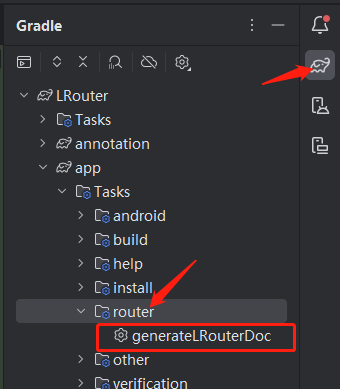

# LRouter

适用于 `Android` 的路由框架, 核心功能：为组件化项目提供 通信、解耦、初始化、路由。

## 简介

之前一直在用阿里开源的 [ARouter](https://github.com/alibaba/ARouter/tree/master)路由。 随着 Gradle
版本迭代以及新技术的不断推出。ARouter 开始有些不太适合了。原因如下：

1. AGP 8.0 以上直接废弃了 Transform，ARouter 路由插件不能用了。
2. 如果不用插件自动注册，启动时扫描 Dex 文件，很影响启动速度
3. ARouter 是基于Java 开发的，用的Java 注解处理器，如果是Kotlin 项目 KAPT 处理很慢，有更快的 KSP 不能支持
4. 路由过程中用到了反射

为解决以上问题花费了好多下班时间手撸了新的路由框架： [`LRouter`](https://github.com/aleyn97/router)。

为了方便 ARouter 往 LRouter 迁移，注解名 和 API 方法名也基本保持了跟 ARouter 一致

使用需知：

- LRouter 仅支持 AGP 7.4 及以上更高版本。7.4 以下就不做支持了。
- 工程必须使用 Kotlin (可以Java & Kotlin 混编但不能没有 Kotlin)
- 必须添加 KSP 支持

说明下不支持低版本 AGP 的原因：ARouter 官方近两年没更新过库了，感觉官方没有更新的想法了。
写 LRouter 的初衷也是为了做 ARouter 的延续。不至于让在 AGP 8 以上没有合适的路由框架可用。
如果项目是低 AGP 版本可以继续用 ARouter。

## 功能介绍

1. **页面路由及参数注入**
2. **路由拦截器，可指定优先级**
3. **模块单独初始化**
4. **依赖注入**
5. **生成路由文档**
6. **支持增量编译**
7. **支持动态注册路由信息**
8. **支持 ActivityLaunch**
9. **支持Object 参数传递**
10. **支持 Fragment**

## 引用方式

###### 版本

LRouter Last Version:

[](https://jitpack.io/#aleyn97/router)

- setting.gradle:

``` groovy
dependencyResolutionManagement {
    repositoriesMode.set(RepositoriesMode.FAIL_ON_PROJECT_REPOS)
    repositories {
       ...
        maven { url "https://jitpack.io" }
    }
}
```

- root build.gradle:

``` groovy
buildscript {
    dependencies {
        classpath com.github.aleyn97.router:plugin:last-version
    }
}

plugins {
    //...
    id 'com.google.devtools.ksp' version "x.y.z-x.y.z" // 添加 KSP, 项目已经有的忽略
}
```

- module build.gradle:

```groovy
plugins {
    //...
    id 'aleyn-router'
}
```

注意有使用到 LRouter 功能的每个 Module 都要添加插件, 不能只添加一个 APP 工程。如果项目没用到 KSP
记得添加上去。不添加插件也会抛异常提醒添加的。

以上配置完成就能正常使用了，**插件会自动添加依赖**。

## 基本使用

#### 路由

添加注解到 `Activity` 或者 `Fragment`

```
@Route(path = "/Main/Main")
class MainActivity : BaseActivity() {
    //...
}

@Route(path = "/Main/Home")
class MainFragment : BaseFragment() {
    //...
}

```

导航到对应页面

```
LRouter.navigator("/Main/Home")
```

一个简单的路由就完成了。

#### 参数注入

BaseActivity 中添加 `LRouter.inject(this)`：

```
abstract class BaseActivity : AppCompatActivity() {

    override fun onCreate(savedInstanceState: Bundle?) {
        super.onCreate(savedInstanceState)
        LRouter.inject(this)
    }
}
```

设置导航参数

``` kotlin
LRouter.build("/Main/Main")
    .withString("nickname", "Aleyn")
    .withInt("age", 18)
    .withAny("userInfo", UserInfo(//....))
    .navigation()
    
    //注意 当使用 ActivityResultLauncher 时 navigation() 必须加 Context 参数
LRouter.build("/Main/Main")
    .withActivityLaunch(activityLaunch)
    .navigation(this)
    //  .navigation(requireContext())  // Fragment 用 requireContext()
    
```

使用 `@Autowired` 注入

```kotlin
@Route(path = "/Main/Main")
class MainActivity : BaseActivity() {

    @Autowired("nickname") //指定key 为 nickname
    var name = ""

    @Autowired  //不指定key 默认用字段名 `age` 做为key
    var age = 0

    @Autowired
    lateinit var userInfo: UserInfo  // 序列化对象

}
```

八大基本数据类型和 String 还有序列化对象,都是直接放在 Bundle 里的。其他没有序列化的对象或者List、Map等集合类型会转成
Json 字符串,取参的时候再解析。

#### 获取Fragment

```kotlin
    LRouter.build("/Main/Home").getFragment()
// 或者 
LRouter.build("/Main/Home").asFragment<Fragment>()
```

`getFragment` 和 `asFragment<T>`的 区别：前者返回 Fragment，后者返回指定泛型 Fragment

#### 导航监听

当要监听多个 的时候可以用 `navCallback()`,指定出需要的方法

```kotlin
LRouter.build("/Main/Home").navCallback(
    onInterrupt = {},
    onLost = {},
    onFound = {},
    onArrival = {},
)
```

监听单个 的时候可以用以下四个扩展方法：

```kotlin
LRouter.build("/Main/Home").navInterrupt {
    // 导航中断
}
LRouter.build("/Main/Home").navFound {
    // 找到导航对应注册信息
}
LRouter.build("/Main/Home").navLost {
    // 没有找到
}
LRouter.build("/Main/Home").navArrival {
    // 导航执行成功
}
```

在应用启动时也可以添加全局的：

```kotlin
LRouter.setNavCallback(object : NavCallback {
    override fun onLost(navigator: Navigator) {
        Log.d(TAG, "onLost: ${navigator.path}")
    }

    override fun onFound(navigator: Navigator) {
        Log.d(TAG, "onFound: ${navigator.path}")
    }

    override fun onArrival(navigator: Navigator) {
        Log.d(TAG, "onArrival: ${navigator.path}")
    }

    override fun onInterrupt(navigator: Navigator) {
        Log.d(TAG, "onInterrupt: ${navigator.path}")
    }
})
```

如果某个导航单独设置了监听，全局监听不会执行。优先级低于单独设置

#### 拦截器

可指定 拦截器优先级默认是 0， 值越大越先执行比如: `@Interceptor(3)`:

```kotlin
@Interceptor
class RoomInterceptor : LRouterInterceptor {

    override fun intercept(navigator: Navigator): Navigator {
        if (navigator.path == "/Room/Home") {
            return navigator.newBuilder()
                .replaceUrl("/First/Home")
                .build()
        }
        return navigator
    }
}
```

拦截器 `intercept`方法需要返回一个 Navigator 对象，根据入参 Navigator 来处理自己业务。
上边例子是拦截到 `/Room/Home` 跳转，替换成 `/First/Home` 页面。 如果要中断路由直接`return null` 即可。

#### 模块初始化

`LRouter` 提供每个Module 单独初始化能力，功能类似Google 的 `androidx.startup.Initializer`
。使用`androidx.startup.Initializer`时，每个模块的`Initializer`都需要统一在主工程添加，或者在 Base
模块用反射添加。
`Lrouter` 只需继承`LRouterInitializer`接口并添加 `@Initializer` 注解。解耦更加彻底。

```kotlin
// priority 同拦截器类似，值越大越先执行， priority 默认为 0。async 是否异步执行 默认false
@Initializer(priority = 1, async = false)
class AppModelInit : LRouterInitializer {

    override fun create(context: Context) {
        Log.d("AppModelInit", "create: AppModelInit")
    }

}
```

如果某个模块必须要在另一个模块初始化完之后才开始初始化操作。这时这两个模块就要放在同一个线程执行了，也就是要么都异步，要么都在主线程。

#### 依赖注入

LRouter
提供简单的注入功能，只是为了模块间的解耦和通信。如果项目需要更完善的注入功能就可以不用 `LRouter`
的注入了。像 `Dagger2` 、`Hilt`、`Koin` 等都是很优秀的注入库。有作用域管理及其他比较完善的功能。

`LRouter` 正是借鉴了 `Koin` 的实现，`Koin`是一个适合Kotlin 项目使用的注入库。只用了简单几个核心类，修改部分代码，配合
KSP 就实现了注入功能。

以下四个注入相关注解：

`@Singleton` 有两个参数，`bind` 为绑定的 Class 默认绑定父级, `lazy`是否懒加载 (第一次用到才创建)
全局只有一个实例

`@Factory`只有 `bind` 为绑定的 Class 默认绑定父级，使用 @Factory 每次都会创建新的实例

`@Qualifier` 当一个接口被多个类实现的时候，用来设置别名做区分

`@InParam` 指定参数

例子：

```kotlin
@Singleton
class AppProviderImpl : IAppProvider {

    private var count = 0

    override fun getAppInfo(): String {
        count++
        return "this is APP Provider $count"
    }
}
```

获取实例提供了两种方式：

```kotlin
class YouActivity : BaseActivity() {

    @Autowired //1,注解直接注入
    lateinit var appProvider: IAppProvider

    private val appProvider2 by inject<IAppProvider>() // 2,懒加载获取
    // 或者可以这样写跟上边一样
    //private val appProvider2: IAppProvider by inject()

    // ...

    // 一个接口有多个实现类的时候使用限定符获取
    private val roomProvider by inject<IRoomProvider>(sq("room1"))

    private val roomProvider2 by inject<IRoomProvider>(sq("room2"))


}


@Qualifier(value = "room1")
@Singleton
class RoomProviderImpl : IRoomProvider {

    override fun getRoomName(): String {
        return "this is APP Provider 1"
    }
}

@Qualifier("room2")
@Singleton
class RoomProviderImpl2 : IRoomProvider {

    override fun getRoomName(): String {
        return "this is APP Provider2"
    }
}
```

#### 生成路由表

路由表导出，做成了一个单独的Task,要拿到路由表的时候，直接在 AS 里双击 下图Task任务:



会输出到主工程的 `build/router` 目录下。

## 远程AAR

如果使用远程依赖的AAR, 使用`@LRouterModule` 把远程包的Module 类添加进去:

```kotlin 
//可在 1.0.7 版本及后续版本使用
@LRouterModule(
    module_first__ModuleRouter__Registered::class,
    module_main__ModuleRouter__Registered::class,
    module_two__ModuleRouter__Registered::class,
)
class RouterModule
```


## 其他（选择性使用）

#### 自动依赖

`LRouter`是自动添加相关依赖库的，如果想关闭可以在 gradle.properties 中添加：

```groovy
LRouter.auto = false
```

框架就不会自己添加依赖，需要自行添加以下依赖库到各个 Module

```groovy
implementation 'com.github.aleyn97.router:core:last-version'
ksp 'com.github.aleyn97.router:processor:last-version'
```

#### 插件添加

```groovy
plugins {
    //...
    id 'aleyn-router'
}
```

如果模块很多像上边这样每个模块都去手动加，嫌麻烦的话。
可以像 Demo 那样在 root build.gradle 中递归添加，添加规则要根据自己项目自己写了。
Demo 里每个 模块的名字都是 Module 开头的。就可以这样写：

```groovy
subprojects.forEach {
    it.afterEvaluate {
        def isAndroid = (it.plugins.hasPlugin('com.android.application')
                || it.plugins.hasPlugin('com.android.library'))
        def isModule = it.name.startsWith('module') || it.name.startsWith('app')
        if (isAndroid && isModule) {
            it.plugins.apply('aleyn-router')
        }
    }
}
```